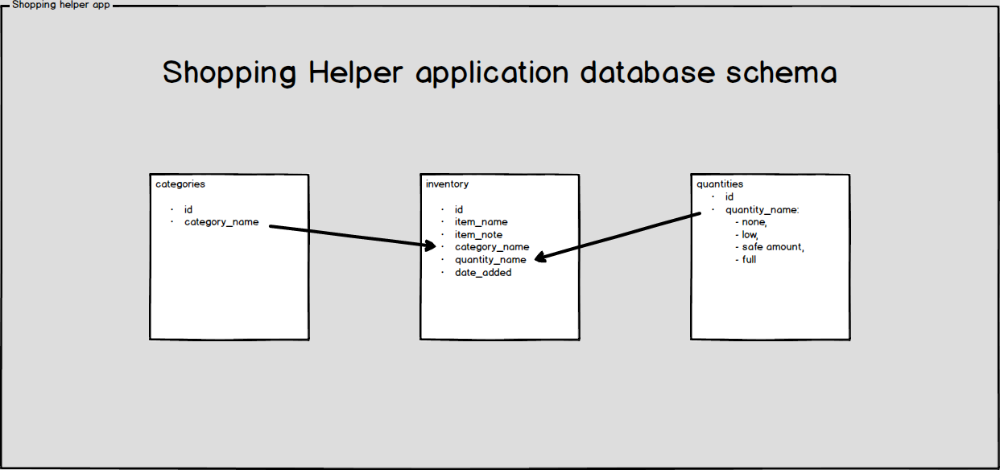

# Shopping Helper Application

Third Milestone Project - Data-Centric Development - Code Institute

The aim of Shopping Helper application is to help managing household's food supplies and optimize groceries shopping. Application consists of two main sections: Supplies Inventory and a Shopping List. User can add products to the inventory, specifying their name, category and quantity. If the amount of a certain product is set to 'low' or 'none', the item will appear on a Shopping list. User can also add new categories and edit them. I don't like preparing shopping lists, as I always forget to put something on it or I end up buying products that I already have, but I don't remember about that fact. The goal of the application is to prevent 'overbuying' products and waste less food. This can be achieved by keeping the information in the database up-to-date.

Table of contents:
- [Overview](#shopping-helper-application)
- [UX](#ux)
- [User stories](#user-stories)
- [Features](#features)
  - [Existing features](#existing-features)
  - [Features left to implement](#features-left-to-implement)
- [Technologies used](#technologies-used)
- [Testing](#testing)
- [Deployment](#deployment)
- [Acknowledgements](#acknowledgements)

## UX
The applcation can serve anyone in their day-to-day shopping. It can help the user to monitor current amounts of products in their kitchen/storage and automatically create shopping list based on that information. If the information in the database is accurate, it should help users optimize their shopping.

### User stories

* As a user I want to be able to add products to the database, specifying their current quantity, category and adding a short note,
* As a user I want to be able to add a new category,
* As a user I want to be able to edit an existing category,
* As a user I want to be able to view the shopping list, to see what I need to buy,
* As a user I want to be able to search the database, to see if I'm in possession of a certain product,
* As a user I want to be able to monitor quantity of different products that I own,
* As a user I want to be able to update the details of owned products, such as: name, note, quantity, category,
* As a user I want to be able to delete products from the database,
* As a user I want to be able to check when the item had been previously bought,
* As a user I want to be able to remove items from the shopping list after buying them
* As a user I want to be able to do shopping by department

Shopping Helper uses a database that consists of three collections:
- Inventory collection,
- Categories collection,
- Quantities collection,

The categories and quantities collections are nested in the inventory collection. New documents can be added to the categories collection and modified as well. The quantities collection has four predefined documents that represent states and cannot be altered by the user. The inventory collection is created by user, based on the information on the products they own (or lack) in their kitchen/storage. Please see the database schema below:

[Here](wireframes/) you can find wireframes for different views of the application across various devices:
- desktop / laptop,
- tablet,
- smartphone

## Features

### Existing features:

- [x] Feature 1 - allows users to add products to the database, by having them fill out the form under 'Add Item' link from the navigation bar / mobile menu,
- [x] Feature 2 - allows users to add new categories, by having them fill out the form under 'Add / Edit Category' link from the navigation bar / mobile menu,
- [x] Featire 3 - allows users to edit existing categories, by having them click the 'Edit' button next to category name,
- [x] Feature 4 - allows users to view the shopping list, by clicking / tapping on the 'Shopping List' link from the navigation bar / mobile menu,
- [x] Feature 5 - allows users to search for products in the database, by having them fill out the search form in the main application view,
- [x] Feature 6 - allows users to monitor quantity of different products, by clicking / tapping on specific categories in the main application view,
- [x] Feature 7 - allows users to update the information about the products by clicking / tapping the 'Edit' button, located to the right of product info in the main application view,
- [x] Feature 8 - allows users to remove products from the database by clicking / tappning the 'Remove' button, located to the right of the product info in the main application view,
- [x] Feature 9 - allows users to check when the item had been previously bought and it is shown in the product info in the main application view,
- [x] Feature 10 - allows users to remove items from the 'Shopping list' by clicking the 'Bought' button, next to the item details in the Shopping List view. It also updates the quantity of a product to 'full'
- [x] Feature 11 - allows users to do their shopping by department. It is achieved by listing the products on the shopping list by category.

### Features left to implement:

- [ ] Form validation - currently app has no forms validation

The purpose of the app is to help managing household supplies by keeping track of posessed goods and create shopping list based on the quantities of these products. Users can add the products they have in their storage using 'Add item' form and specifying item's name, category, quantity. A short note can also be added. Apart from these four values, current timestamp is also being added to the database. User can choose from 4 quantities that will be assigned to the product: full, safe amount, low and none. If quantity of product is 'low' or 'none', the item will display on the 'Shopping list'. Products are ordered by the category. User can view what products are under specific category by clicking on it.
Shopping list shows the products which quantity is either 'low' or 'none'. When doing shopping, user can tap on 'Bought' button whenever an item is placed in the basket. This will remove item from the list and will change its quantity to 'full'.

## Technologies used
Application was built using using the following technologies:
* [Python](https://www.python.org/)
* [Flask framework](http://flask.palletsprojects.com/en/1.1.x/)
* [Materialize CSS library](https://materializecss.com/)
* [Jinja templating language](https://jinja.palletsprojects.com/en/2.10.x/)
* [jQuery library](https://jquery.com/)
* [HTML](https://html.spec.whatwg.org/)
* [CSS](https://docs.ckan.org/en/ckan-2.7.3/contributing/css.html)

## Testing

## Deployment

## Acknowledgements